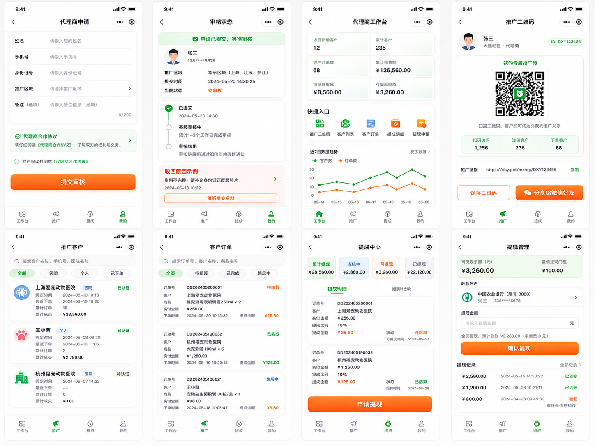
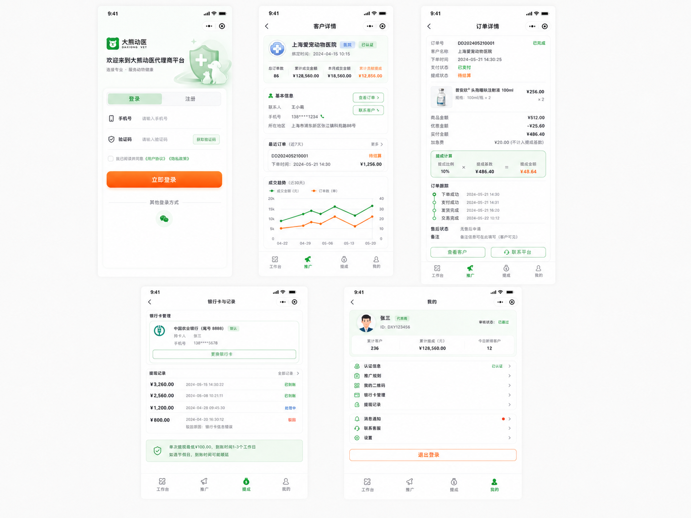
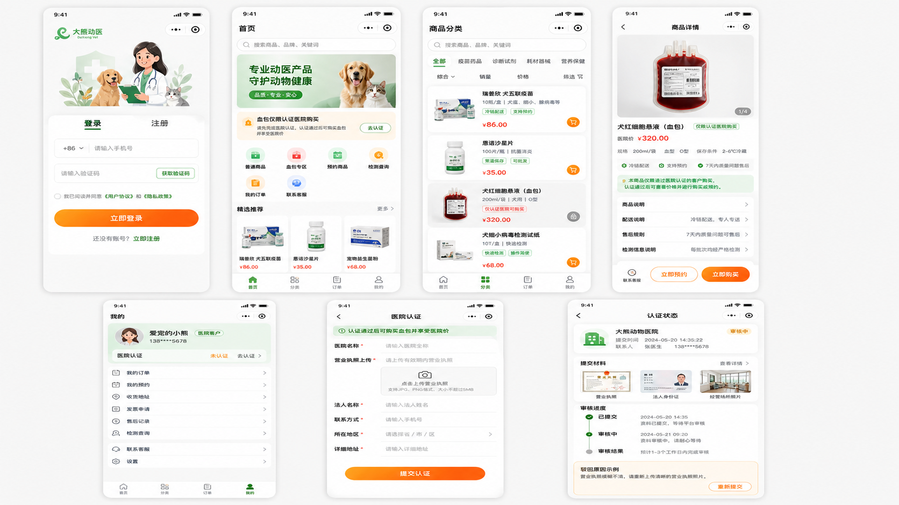
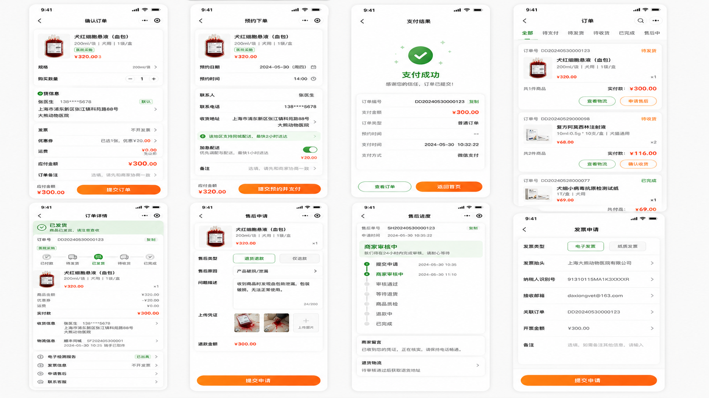
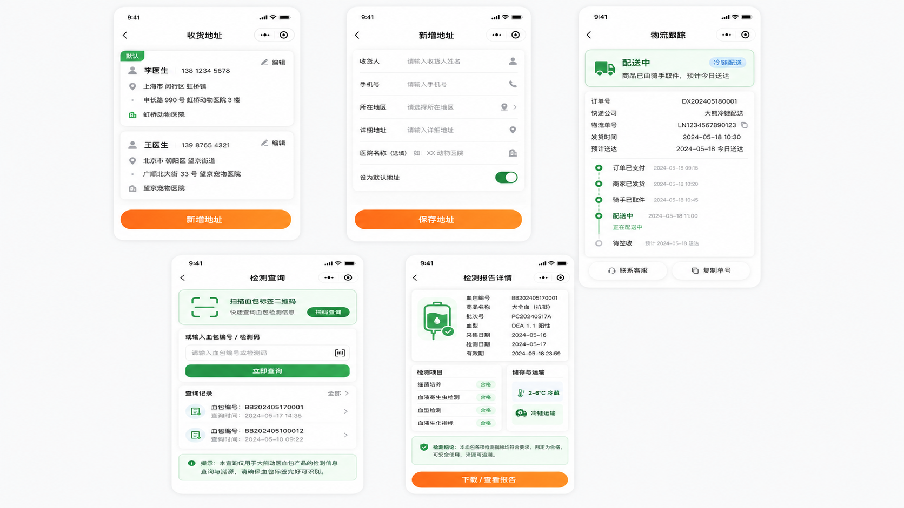
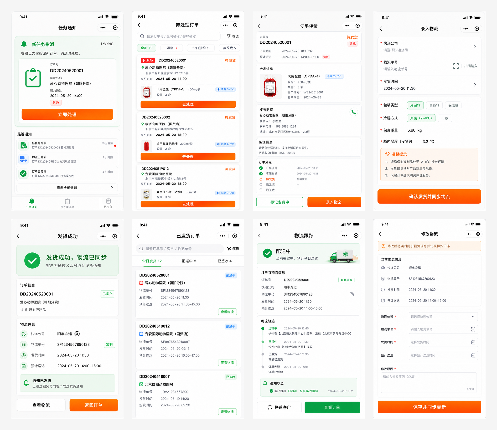

# 大熊动医设计图索引

> 日期：2026-05-07  
> 来源目录：`/Users/combo/MyFile/my-data/projects/common/dxdy-design/`  
> 项目内存放目录：`docs/superpowers/assets/dxdy-design/`

## 图片清单

| 原始文件 | 项目内文件 | 角色/范围 | 说明 |
|---|---|---|---|
| `代理商1.png` | `../assets/dxdy-design/agent-1.png` | 代理商 | 代理商申请、审核状态、工作台、推广二维码、推广客户、客户订单、提成中心、提现管理。 |
| `代理商2.png` | `../assets/dxdy-design/agent-2.png` | 代理商 | 登录、客户详情、订单详情、银行卡与提现记录、我的页面。 |
| `客户1.png` | `../assets/dxdy-design/customer-1.png` | 客户 | 登录、首页、商品分类、商品详情、我的、医院认证、认证状态。 |
| `客户2.png` | `../assets/dxdy-design/customer-2.png` | 客户 | 确认订单、预约下单、支付结果、订单列表、订单详情、售后申请、售后进度、发票申请。 |
| `客户3.png` | `../assets/dxdy-design/customer-3.png` | 客户 | 收货地址、新增地址、物流跟踪、检测查询、检测报告详情。 |
| `制单员.png` | `../assets/dxdy-design/clerk.png` | 制单员 | 任务通知、待处理订单、订单详情、录入物流、发货成功、已发货订单、物流跟踪、修改物流。 |

## 预览

### 代理商 1

### 代理商 2

### 客户 1

### 客户 2

### 客户 3

### 制单员

## 使用建议

- 需求分析和差异文档引用这些图片时，优先使用项目内相对路径。
- 后续实现拆任务时，可按角色拆为代理商端、客户端、制单员端三组。
- 图片仅作为视觉与流程参考，真实数据结构和接口仍以 CloudBase 项目级环境为准。
